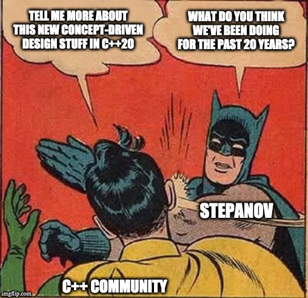
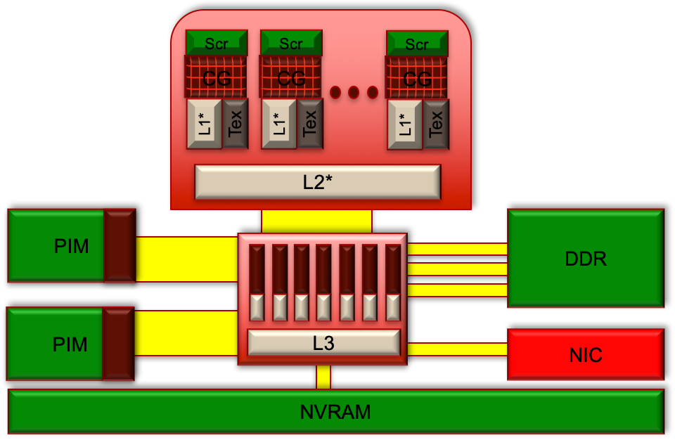
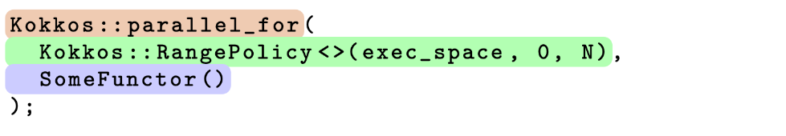

<!-- .slide: class="title-slide snl-slide" -->

<!-- ################################################################################ -->

---
<!-- .slide: class="content-slide snl-slide" style="font-size: 100%" --> 

@snap[north span-100 slide-title]
### Follow along! <!-- {{{2 -->
@snapend

## [dsh.fyi/cppcon-2019](https://dsh.fyi/cppcon-2019)

<div class="space-3"></div>


<!-- }}}2............................................................................ -->

---
<!-- .slide: class="content-slide snl-slide" style="font-size: 100%" --> 

@snap[north slide-title]
### Outline <!-- {{{1 -->
@snapend

@ul
* Introduction
    * Hyrum's Law
    * This talk: a specific scenario 
    * Concept-driven Design
* Breaking things, by example
    * Contrived example: Containers
    * Real-world example: Executors in Kokkos
* Live demo?
* Conclusions
@ulend

<!-- }}}1............................................................................ -->

<!-- ################################################################################ -->

---
<!-- .slide: class="content-slide snl-slide" style="font-size: 100%" --> 

## Introduction <!-- {{{1 -->

---
<!-- .slide: class="content-slide snl-slide" style="font-size: 100%" --> 

@snap[north span-100 slide-title]
### Hyrum's Law <!-- {{{2 -->
@snapend

@quote[With a sufficient number of users of an API,<br/>it does not matter what you promise in the contract:<br/>all observable behaviors of your system<br/>will be depended on by somebody.](Hyrum's Law, named as such by Titus Winters)
<!-- .element: class="boxed-with-shadow span-80" -->


<!-- }}}2............................................................................ -->

---
<!-- .slide: class="content-slide snl-slide" style="font-size: 100%" --> 

@snap[north span-100 slide-title]
### Obligatory XKCD <!-- {{{2 -->
@snapend


<!-- .element: class="boxed-with-shadow span-35" -->


<!-- }}}2............................................................................ -->

---
<!-- .slide: class="content-slide snl-slide" style="font-size: 100%" --> 

@snap[north span-100 slide-title]
### Main Argument of this Talk <!-- {{{2 -->
@snapend


@box[boxed-with-shadow span-80-center box-vertical-center font-150](When faced with the possibility of exposing implicit behaviors in a system, developers should think hard about ways to ensure that code dependent on those implicit behaviors doesn't <span class="snl-medium-blue text-bold">"accidentally"</span> work.)


<!-- }}}2............................................................................ -->


---
<!-- .slide: class="content-slide snl-slide" style="font-size: 90%" --> 

@snap[north span-100 slide-title]
### A Specific Scenario <!-- {{{2 -->
@snapend

<div class="twocolumn">
<div style="margin-right:1em; text-align:center">
<div class="dark-boxed-with-shadow">
<h4 style=" margin-left: 20px; color: #ffffff">Library</h4>
<!-- .element: style=" margin-left: 20px; color: #ffffff" -->
@ul
* Provides interface in terms of concepts
* Provides a set of models for that concept
* Expects users to write code that is generic over those concepts
* Wants to reduce client's reliance on implicit behavior across (usually subsets of) models provided
@ulend
<!-- .element: style="margin: 20px; margin-left: calc(20px + 1em); text-align:left" -->
</div>
</div>
<div style="margin-left:1em; text-align:center">
<div class="boxed-with-shadow">
<h4 style=" margin-left: 20px;">Client</h4>
@ul
* Writes code that is generic over library concepts
* *Users of client code* select which model of the concepts will be used
* Client algorithms must obey the generic contracts of the concepts, not implicit behavior of individual models
* Needs to write tests that enforce this
@ulend
<!-- .element: style="margin: 20px; margin-left: calc(20px + 1em); text-align:left" -->
</div>
</div>


<!-- }}}2............................................................................ -->

<!-- }}}1............................................................................ -->

<!-- ################################################################################ -->

---
<!-- .slide: class="content-slide snl-slide" style="font-size: 100%" --> 

## Concept-driven Design in General <!-- {{{1 -->

<!-- ................................................................................ -->

---
<!-- .slide: class="content-slide snl-slide" style="font-size: 100%" --> 

@snap[north span-100 slide-title]
### Concept-driven design is not new <!-- {{{2 -->
@snapend


<!-- .element: class="boxed-with-shadow" -->

<!-- }}}2............................................................................ -->

---
<!-- .slide: class="content-slide snl-slide" style="font-size: 90%" --> 

@snap[north span-100 slide-title]
### Concept-Driven Design: Look at the Algorithms! <!-- {{{2 -->
@snapend

@quote[In some sense the only way for someone to fully understand why they have to be the way they are is by trying hundreds of different algorithms and finding the abstraction that allows the most beautiful and efficient representation of them. As a matter of fact, the only way of finding a useful abstraction is by trying to write code in terms of it. Sadly enough, people tend to define abstractions faster than they try them.](Alexander Stepanov, "Notes on Programming" &lpar;2006&rpar;, originally speaking about iterator design.)
<!-- .element: class="span-90 boxed-with-shadow" -->

@quote[Although Concepts are constraints on types, you don't find them by looking at the types in your system. You find them by studying the algorithms.](E. Niebler, Twitter and numerous hallway conversations)
<!-- .element: class="boxed-with-shadow" -->

<!-- }}}2............................................................................ -->

---
<!-- .slide: class="content-slide snl-slide" style="font-size: 100%" --> 

@snap[north slide-title]
### Concept are more than Compile-time Constraints <!-- {{{2 -->
@snapend

<div class="fragment layout-ignore">
@quote[Concepts = Constraints + Axioms](A. Sutton and B. Stroustrup, SLE '11)
<!-- .element: class="boxed-with-shadow" -->
</div>
<br> <br>
<div class="fragment layout-ignore">
@box[dark-boxed-with-shadow span-80-center box-vertical-center](Key Point#C++20 "concepts lite" are a language feature that lacks a way to describe most of the requirements on a concept.  Concepts are not just a set of compile-time requirements!)

</div>

<!-- }}}2............................................................................ -->

---
<!-- .slide: class="content-slide snl-slide" style="font-size: 100%" --> 

<!-- {{{2 -->

<!-- }}}2............................................................................ -->

<!-- }}}1............................................................................ -->

<!-- ################################################################################ -->

---
<!-- .slide: class="content-slide snl-slide" style="font-size: 100%" --> 

## Breaking things with Concept-driven Design <!-- {{{1 -->

---
<!-- .slide: class="content-slide snl-slide" style="font-size: 100%" --> 

## Contrived Example: Containers <!-- {{{2 -->

<!-- }}}2............................................................................ -->

---
<!-- .slide: class="content-slide snl-slide" style="font-size: 100%" --> 

@snap[north span-100 slide-title]
### What's wrong here? <!-- {{{2 -->
@snapend

```c++
template <typename Container, typename UnaryPredicate>
void replicate_if(Container& c, UnaryPredicate const& pred) {
  for(auto const& val : c) {
    if(pred(val)) {
      c.push_back(val);
    }
  }
}
```
<!-- .element: class="span-70" -->


<!-- }}}2............................................................................ -->

---
<!-- .slide: class="content-slide snl-slide" style="font-size: 100%" --> 

@snap[north span-100 slide-title]
### Iterator Invalidation! <!-- {{{2 -->
@snapend

```c++
template <typename Container, typename UnaryPredicate>
void replicate_if(Container& c, UnaryPredicate const& pred) {
  for(auto const& val : c) {
    if(pred(val)) {
      c.push_back(val);
    }
  }
}
```
<!-- .element: class="span-70" -->

@ul
* The semantics of the `Container` concept allow `push_back` to invalidate *any* iterators and references to elements.
* This code @css[snl-medium-blue text-bold]("accidentally") works for `std::list`, `std::deque`, and even sometimes `std::vector` (when `capacity()` is enough larger than `size()`)
@ulend


<!-- }}}2............................................................................ -->

---
<!-- .slide: class="content-slide snl-slide" style="font-size: 100%" --> 

@snap[north span-100 slide-title]
### "Breaking" `Container`s <!-- {{{2 -->
@snapend

<div class="twocolumn">
 <div style="margin-right:1em; margin-top:0.7em; text-align:center">
  <div class="boxed-with-shadow">
   <div id="boxed-text-title-box"><span id="boxed-text-title">Identify what is accidentally working</span></div>
   <ul style="margin: 20px; margin-left: calc(20px + 1em); text-align:left">
   <li class="fragment" data-fragment-index=1>User assumes the `begin` iterator is still valid after a call to `push_back()`</li>
   </ul>
  </div>
 </div>
 <div style="margin-left:1em; text-align:center">
  <div class="dark-boxed-with-shadow">
   <div id="boxed-text-title-box"><span id="boxed-text-title">Construct models that exemplify those extremities</span></div>
   <ul style="margin: 20px; margin-left: calc(20px + 1em); text-align:left">
   <li class="fragment" data-fragment-index=2>Provide a test model for `Container` that invalidates its iterators *every* time `push_back()` is called</li>
   </ul>
  </div>
 </div>
</div>


<!-- }}}2............................................................................ -->

<!-- }}}1............................................................................ -->

<!-- ################################################################################ -->

---
<!-- .slide: class="content-slide snl-slide" style="font-size: 100%" --> 

## Real-world example: `ExecutionSpace`s and `MemorySpace`s in Kokkos <!-- {{{1 -->

<!-- ................................................................................ -->

---
<!-- .slide: class="content-slide snl-slide" style="font-size: 90%" --> 

@snap[north span-100 slide-title]
### Kokkos @css[kok-exec-space](`ExecutionSpace`s) and @css[kok-mem-space](`MemorySpace`s) <!-- {{{2 -->
@snapend

	
<!-- .element: style="width:80%" -->


<!-- }}}2............................................................................ -->

---
<!-- .slide: class="content-slide snl-slide" style="font-size: 100%" --> 

@snap[north span-100 slide-title]
### A Brief, Oversimplified Overview of Kokkos <!-- {{{2 -->
@snapend


<!-- .element: class="boxed-with-shadow" -->


<div class="twocolumn">
<div>
@box[bg-kok-pattern-color font-150 rounded span-80 box-vertical-center fragment](`ParallelPattern`)
<!-- .element: style="background-color: #EFCCB3; border: 2px black solid" -->
</div>
<div>
@box[bg-kok-pattern-color font-150 rounded span-80 box-vertical-center fragment](`ExecutionPolicy`)
<!-- .element: style="background-color: #B3FFB3; border: 2px black solid" -->
</div>
</div>

@box[bg-kok-pattern-color font-150 rounded span-40-off-center box-vertical-center fragment](`ParallelFunctor`)
<!-- .element: style="background-color: #CDCDFF; border: 2px black solid" -->


<!-- }}}2............................................................................ -->

---
<!-- .slide: class="content-slide snl-slide" style="font-size: 95%" --> 

@snap[north span-100 slide-title]
### A (Broken) Example <!-- {{{2 -->
@snapend

```c++
template <typename ExecutionSpace, typename MemorySpace>
void my_function(ExecutionSpace ex, MemorySpace mem) {
  Kokkos::View<double**, MemorySpace> data = { mem, 100, 200 };
  Kokkos::parallel_for(
    Kokkos::MDRangePolicy{ex, {0, 0}, {100, 200}},
    [=] KOKKOS_FUNCTION (int i, int j) {
      data(i, j) = i * j;
    }
  );
  assert(data(6, 7) == 42);
}
```

@ul
* Create a 100x200 array named `data` in the memory space `mem` 
* Use the Kokkos `ParallelPattern` named `parallel_for`
* Use the Kokkos `ExecutionPolicy` named `MDRangePolicy` with the execution space `ex`
* For each `i` from 0 to 100 and `j` from 0 to 200, store `i*j` in `data(i,j)`
* Assert that `data(6,7)` is 42 after the `parallel_for`
@ulend

<!-- }}}2............................................................................ -->

---
<!-- .slide: class="content-slide snl-slide" style="font-size: 90%" --> 

@snap[north span-100 slide-title]
### It "accidentally" works (sometimes) <!-- {{{2 -->
@snapend


<div class="twocolumn" style="grid-template-columns: 65% 35%">
  <div style="padding-top: 2.5em">
@code[cpp](snippets/parfor.cpp)
  </div>
  <div>
@code[cpp](snippets/myfun_calls.cpp)
  </div>
</div>

@[1-11, 12-16]
@[1-11, 18-23]
@[1-11, 25-30]

<!-- }}}2............................................................................ -->

---
<!-- .slide: class="content-slide snl-slide" style="font-size: 93%" --> 

@snap[north span-100 slide-title]
### "Fixed" Example <!-- {{{2 -->
@snapend


```c++
template <typename ExecSpace, typename MemSpace>
void my_function(ExecSpace ex, MemSpace mem) {
  static_assert(Kokkos::SpaceAccessibility<ExecSpace, MemSpace>::accessible);
  Kokkos::View<double**, MemSpace> data = { mem, 100, 200 };
  Kokkos::parallel_for(
    Kokkos::MDRangePolicy{ex, {0, 0}, {100, 200}},
    [=] KOKKOS_FUNCTION (int i, int j) {
      data(i, j) = i * j;
    }
  );
  using host_exec = Kokkos::DefaultHostExecutionSpace;
  if constexpr(Kokkos::SpaceAccessibility<host_exec, MemSpace>::accessible) {
    Kokkos::fence();
    assert(data(6, 7) == 42);
  } else {
    Kokkos::parallel_for(
      Kokkos::RangePolicy{ex, 0, 1},
      [=] KOKKOS_FUNCTION (int) { KOKKOS_ASSERT(data(6, 7) == 42); }
    );
    Kokkos::fence();
  }
}
```

@[3](`static_assert` that `ex` and `mem` are compatible)
@[11-12](Check for data accessibility on host)
@[13-14](If accessible, fence and assert on the host)
@[16-19](Otherwise, run the assertion somewhere that's guaranteed to have access to `data` )
@[1-22]


<!-- }}}2............................................................................ -->

---
<!-- .slide: class="content-slide snl-slide" style="font-size: 100%" --> 

@snap[north span-100 slide-title]
### "Breaking" the `ExecutionSpace` <!-- {{{2 -->
@snapend


<div class="twocolumn">
 <div style="margin-right:1em; margin-top:0.3em; text-align:center">
  <div class="boxed-with-shadow">
   <div id="boxed-text-title-box"><span id="boxed-text-title">Identify what is accidentally working</span></div>
   <ul style="margin: 20px; margin-left: calc(20px + 1em); text-align:left">
   <li class="fragment" data-fragment-index=1>User assumes parallel kernel is executing <i>earlier</i> than it's required to</li>
   <div class="space-5"></div>
   <li class="fragment" data-fragment-index=3>User assumes parallel kernel is executing <i>later</i> than it's required to</li>
   </ul>
  </div>
 </div>
 <div style="margin-left:1em; text-align:center">
  <div class="dark-boxed-with-shadow">
   <div id="boxed-text-title-box"><span id="boxed-text-title">Construct models that exemplify those extremities</span></div>
   <ul style="margin: 20px; margin-left: calc(20px + 1em); text-align:left">
   <li class="fragment" data-fragment-index=2>Provide a model of `ExecutionSpace` that always waits until `Kokkos::fence()` to run</li>
   <div class="space-2"></div>
   <li class="fragment" data-fragment-index=4>Provide an execution space that always runs as soon as the kernel is created</li>
   </ul>
  </div>
 </div>
</div>

<!-- }}}2............................................................................ -->

---
<!-- .slide: class="content-slide snl-slide" style="font-size: 100%" --> 

@snap[north span-100 slide-title]
### "Breaking" the `MemorySpace` <!-- {{{2 -->
@snapend


<div class="twocolumn">
 <div style="margin-right:1em; margin-top:0em; text-align:center">
  <div class="boxed-with-shadow">
   <div id="boxed-text-title-box"><span id="boxed-text-title">Identify what is accidentally working</span></div>
   <ul style="margin: 20px; margin-left: calc(20px + 1em); text-align:left; font-size:90%">
    
   <li class="fragment" data-fragment-index=1>User assumes a `View` is accessible <i>inside</i> of a parallel kernel when it's not</li>
   <li class="fragment" data-fragment-index=2>User assumes a `View` is accessible <i>outside</i> of a parallel kernel (i.e., from the host) when it's not</li>
   <div class="space-2"></div>
   <li class="fragment" data-fragment-index=4>User assumes memory not managed by a `View` is accessible inside of a parallel kernel</li>
   </ul>
  </div>
 </div>
 <div style="margin-left:1em; text-align:center; margin-top:2em">
  <div class="dark-boxed-with-shadow">
   <div id="boxed-text-title-box"><span id="boxed-text-title">Construct models that exemplify those extremities</span></div>
   <ul style="margin: 20px; margin-left: calc(20px + 1em); text-align:left; font-size: 90%">
   <li class="fragment" data-fragment-index=3>Provide a model of `MemorySpace` that "poisons" memory allocated on it when it's not supposed to be accessible</li>
   <div class="space-5"></div>
   <div class="space-5"></div>
   <li class="fragment" data-fragment-index=5>(In general, requires compiler support)</li>
   </ul>
  </div>
 </div>
</div>

<!-- }}}2............................................................................ -->

---
<!-- .slide: class="content-slide snl-slide" style="font-size: 100%" --> 

## Live Demo? <!-- {{{2 -->

<!-- }}}2............................................................................ -->

---?terminal=assets/live-demo.cast&title=Live Demo Backup
<!-- .slide: class="content-slide snl-slide" style="font-size: 100%" --> 


<!-- }}}2............................................................................ -->

<!-- }}}1............................................................................ -->

---
<!-- .slide: class="content-slide snl-slide" style="font-size: 100%" --> 

## Questions? <!-- {{{1 -->

<!-- ................................................................................ -->

<!-- }}}1............................................................................ -->

<!-- ################################################################################ -->

---
<!-- .slide: class="content-slide snl-slide" style="font-size: 100%" --> 

## Extra Slides <!-- {{{1 -->

---
<!-- .slide: class="content-slide snl-slide" style="font-size: 100%" --> 

@snap[north slide-title]
### Constraint Optimization <!-- {{{2 -->
@snapend

<div class="height-90 move-down-15">

@ul[span-100](false)
* Concept driven design is an *optimization problem* that balances minimization of constraints on a set of algorithms with the minimization of cognitive load on the user.
@ulend

@uml[center span-60](assets/diagrams/constraints.puml)

<div class="twocolumn">
  <div class="fragment font-90">
@quote[The design of a concept library is the result of two minimization problems: concept and constraint minimization.](A. Sutton and B. Stroustrup, SLE '11)
<!-- .element: class="boxed-with-shadow" -->
  </div>
  <div class="fragment font-90">
@quote[An effective specification of concepts is the product of an iterative process that minimizes the number of concepts while maintaining expressive and effective constraints.](A. Sutton and B. Stroustrup, SLE '11)
<!-- .element: class="boxed-with-shadow" -->
  </div>
</div>

</div>

<!-- }}}2............................................................................ -->

---
<!-- .slide: class="content-slide snl-slide" style="font-size: 100%;" -->

@snap[north slide-title]
### Axiom Set Optimization  <!-- {{{2 -->
@snapend

<div class="height-90">

@ul[span-100](false)
* The analogous optimization problem for the semantic axioms looks like:
@ulend

@uml[center span-60](assets/diagrams/axioms.puml)

@ul[]
* The most inclusive solution is to use all of the possible combinations of what everyone thinks the abstraction should do.
* The fewest concepts solution (arguably the least cognitive load) chooses one semantic from each group of conflicting options.
@ulend

</div>

<!-- }}}2............................................................................ -->

---
<!-- .slide: class="content-slide snl-slide" style="font-size: 100%" --> 

@snap[north span-100 slide-title]
### Concrete Example: `atomic<`*floating-point*`>` <!-- {{{2 -->
@snapend

#### Inconsistency:

```c++
++integer; // valid
atomic_integer += 1; // valid
++atomic_integer; // valid

++floating; // valid
atomic_floating += 1; // valid
++atomic_floating; // invalid!
```
<!-- .element: class="span-50" -->

<div class="space-3"></div>

@ul
* Initial reasoning: "I think it just reflects a general sense that one doesn’t use `++`, pre- or post-increment, on floating point numbers. Not even novices. What you do use `+=` for, is parallel reductions, so we covered that much."
@ulend

<!-- }}}2............................................................................ -->

---
<!-- .slide: class="content-slide snl-slide" style="font-size: 90%" --> 

@snap[north span-100 slide-title]
### Applying Concept-driven Design <!-- {{{2 -->
@snapend

@ul
* Step 1: Look at the algorithms!
    * "What you do use `+=` for, is parallel reductions, so we covered that much"
    * What algorithm **set** is this a part of?  (Header `<numeric>` is a reasonable place to start)
    * Do (non-atomic) floating point numbers get used with this algorithm set? Do atomic integer types get used with this algorithm set?
* Step 2: Constraint refinement
    * Adding `operator++` to `atomic<`*floating-point*`>` would reduce the number of concepts used by our algorithm set.
    * Adding other numeric operators (like, say, `operator*=`) would *further* reduce the constraint variety in our algorithm set, so we should consider it.
    * Does the removal of the extra constraint sets unreasonably burden the implementers of types that might use your algorithm set?
@ulend

<div class="space-3"></div>

<!-- }}}2............................................................................ -->

---
<!-- .slide: class="content-slide snl-slide" style="font-size: 100%" --> 

@snap[north span-100 slide-title]
### Applying Concept-driven Design <!-- {{{2 -->
@snapend

@ul
* Step 3: Axiom refinement
    * Do other operators like `operator*=` *mean* the same thing to our algorithms for types that support it?
    * (No, `operator*=` is expected to be significantly more expensive for atomics, so we probably shouldn't spell it the same way as `operator+=`.  Consider as an argument for increasing the number of axiom sets, and thus the number of constraint sets.)
    * Does `operator++` *mean* the same thing to our algorithms?
* Step 4: **Assess cognitive load**
@ulend

<div class="space-3"></div>

@box[dark-boxed-with-shadow span-80-center box-vertical-center fragment](Conclusion: In this case, the starting point of the discussion should have been to ask if there is a compelling reason to *omit* `operator++` from the interface of `atomic<`*floating-point*`>` )

<div class="space-3"></div>

<!-- }}}2............................................................................ -->

<!-- ................................................................................ -->

<!-- }}}1............................................................................ -->

<!-- ################################################################################ -->

---
<!-- .slide: class="content-slide snl-slide" style="font-size: 100%" --> 

## Bonus Example: Breaking ADL <!-- {{{1 -->

<!-- ................................................................................ -->

---
<!-- .slide: class="content-slide snl-slide" style="font-size: 93%" --> 

@snap[north span-100 slide-title]
### A Case Where ADL Accidentally Works <!-- {{{2 -->
@snapend

<div class="space-7"></div>

@ul
* Any time you use write a function or a function template with arguments, you should be aware that users who call functions using unqualified names can "accidentally" call your function.
* Real-world example from Kokkos, a performance portability library
    * (Translation: it makes things like CUDA act more like normal C++)
@ulend

```c++
namespace Kokkos {
  // replacement `std::swap`, for CUDA compatibility
  template <typename T>
  __host__ __device__
  void swap(T& a, T& b);
}
```
<!-- .element: class="fragment span-60" -->

@ul
* What's wrong with this?
    * Now no move-constructible types in namespace `Kokkos` are swappable! @css[fragment]((Unqualified `swap` is ambiguous in the context of `using namespace std;`&rpar;)
    * Things that use swappable, like `std::unique_ptr<Kokkos::complex<double>>` don't compile!
@ulend

Note:

- "I'm about to describe a relatively specific scenario where concept-driven design can help with this, but before I do that I thought I'd throw in a bonus example of this kind of thing that's a bit more generally useful"


<!-- }}}2............................................................................ -->

---
<!-- .slide: class="content-slide snl-slide" style="font-size: 100%" --> 

@snap[north span-100 slide-title]
### How to break ADL: Niebloids <!-- {{{2 -->
@snapend

@ul
* The intention was always to *require* the user to make qualified calls to `Kokkos::swap`.
* Solution: make `Kokkos::swap` an object, not a function
@ulend

```c++
namespace Kokkos {
  namespace Impl {
    struct _swap_niebloid {
      template <typename T>
      __host__ __device__
      void operator()(T& a, T& b) const;
    };
  }
  inline constexpr Impl::_swap_niebloid swap = { };
}
```
<!-- .element: class="fragment span-80" -->

@ul
* Now the user *must* call `Kokkos::swap` as a qualified name, and the unqualified version doesn't find this overload via ADL.
@ulend

<!-- }}}2............................................................................ -->

<!-- }}}1............................................................................ -->
